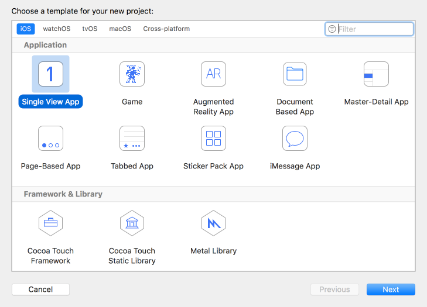
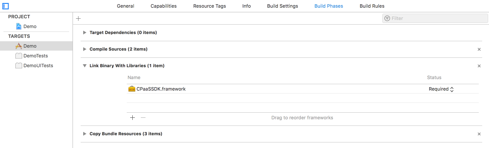
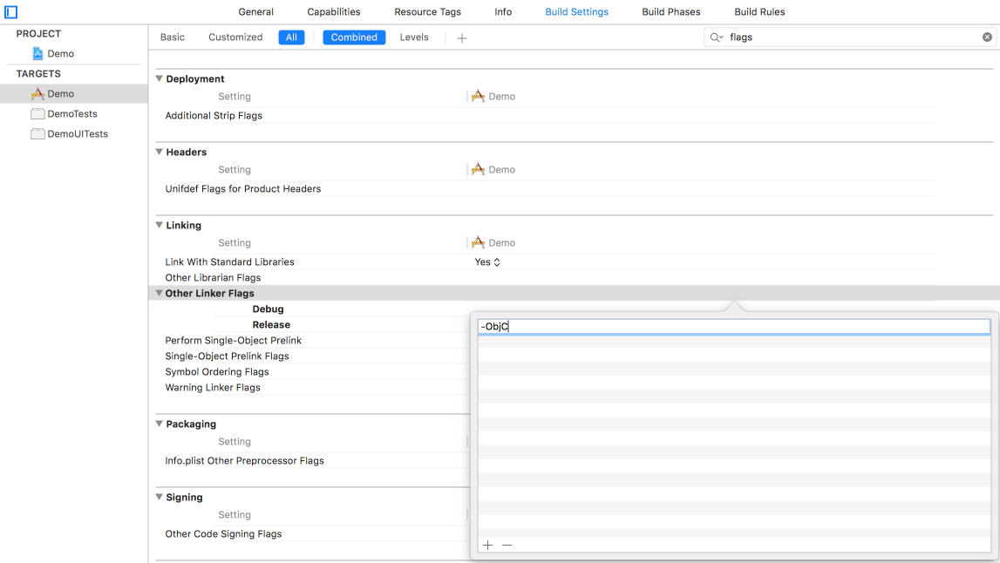
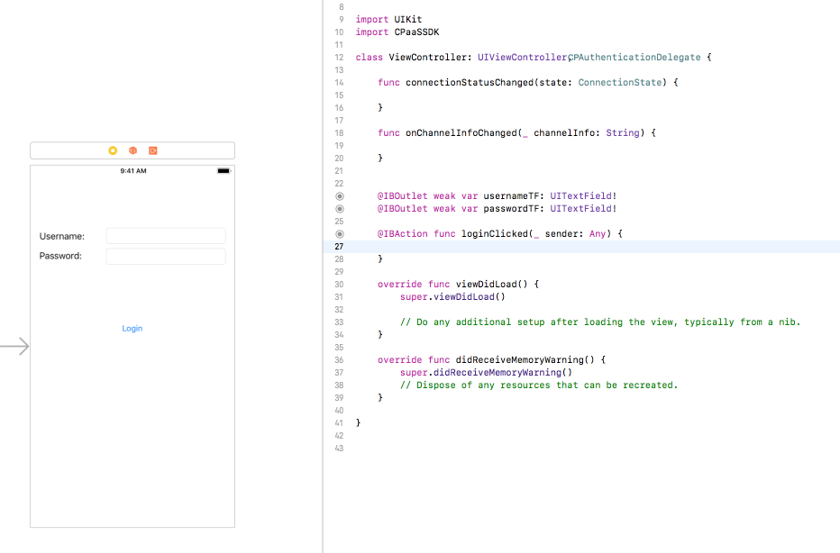
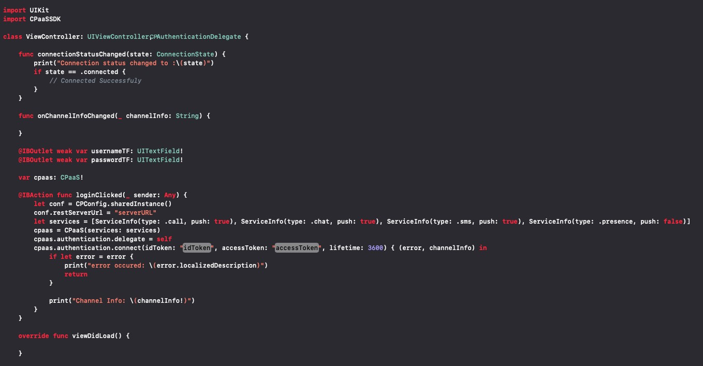

---
  topics:
  - title: Creating the iOS project
    body: In this section you will learn how to create the iOS project using XCode.
  - title: Using the $KANDY$ Mobile SDK in the iOS Project
    body: In this section you will learn how to use the $KANDY$ Mobile SDK in the iOS project.
---
# Get Started

This section contains the required steps for beginning your mobile application development by using $KANDY$ Mobile SDK in the Xcode iOS project.

## Creating the iOS project

1. Open the Xcode application.
2. Click Create a new Xcode project.
3. Click **iOS** heading, select **Single View App**, and click **Next**.



4. Type the project details and click **Create**.
5. Go to project settings and navigate to **Build Phases**.
6. Add **CPaaSSDK.framework** under **Link Binary With Libraries** section.



7. Add the following frameworks to the project under the **Link Binary With Libraries**:
	* AvFoundation.framework
	* SystemConfiguration.framework
	* CFNetwork.framework
	* Security.framework
	* OpenGLES.framework
	* QuartzCore.framework
	* AudioToolbox.framework
	* CoreAudio.framework
	* CoreMedia.framework
	* CoreVideo.framework
	* CoreGraphics.framework
	* UIKit.framework
	* Foundation.framework
	* GLKit.framework
	* libc++.tbd
	* libsqlite3.tbd
	* libstdc++.6.0.9.tbd
	* libstdc++.tbd
	* libicucore.tbd

8. Add WebRTC.framework under the **Embedded Binaries** section in **General** tab on Project Settings. Select **Copy items if needed**.
9. Under the **Build Settings** section, search for **Framework Search Paths** and add the following:

  `$(PROJECT_DIR)/CPaaSSDK.framework/SubFrameworks/`

  **Note:** If framework is located in different place rather than main directory of project, above line should be modified accordingly.

10. **CPaaS SDK** is now ready to implementation.

## Using the $KANDY$ Mobile SDK in the iOS Project

The following part shows how to use **$KANDY$ Mobile SDK** with basic features. While codes are shared for both *Swift* and *Objective-C* languages, some parts may need different implementations, are also indicated.

**If the project language is selected as *Swift*, do the following:**
* Navigate to the **Build Settings** in the project settings.
* Search for **Other Linker Flags** listed under the **Linking** and click.
* Click **+** button in the list appeared next under to the **Other Linker Flags**.
* Type *-ObjC* and close the panel.



* In order to run framework, search for **Enable Bitcode** option listed under the **Build Options**, and change it to the **NO**.

$KANDY$ Mobile SDK is now ready to use in the application.

1. Open *Main.storyboard* and create a basic user interface which contains username, password text fields, and login button.
2. Set **AuthenticationDelegate** to view controller and add protocol stubs.



3. In order to set configurations for registering to $KANDY$, add followings in to login action.

*Swift Code:*
```swift
import CPaaSSDK

let configuration = CPConfig.sharedInstance()
configuration.restServerUrl = "serverURL"
configuration.restServerPort = "port"
configuration.useSecureConnection = true
```
*Objective-C Code:*
```objective-c
@import CPaaSSDK;

CPConfig *configuration = [CPConfig sharedInstance];
configuration.restServerUrl = @"serverURL";
configuration.restServerPort = @"port";
configuration.useSecureConnection = YES;
```

4. When all configurations are set correctly, connect method can be called as following.

*Swift Code:*
```swift
import CPaaSSDK

let services = [CPServiceInfo(type: .call, push: true), CPServiceInfo(type: .chat, push: true), CPServiceInfo(type: .sms, push: true)]

cpaas = CPaaS(services: services)
cpaas.authentication.delegate = self
cpaas.authentication.connect(idToken: <ID-Token>, accessToken: <Access-Token>, lifetime: 3600) { (error, channelInfo) in
    if let error = error {
        print("error occured: \(error.localizedDescription)")
        return
    }

    print("Channel Info: \(channelInfo!)")
}
```
*Objective-C Code:*
```objective-c
@import CPaaSSDK;

NSArray* services= @[[CPServiceInfo buildWithType:CPServiceTypeSms push:YES],
                    [CPServiceInfo buildWithType:CPServiceTypeCall push:YES],
                    [CPServiceInfo buildWithType:CPServiceTypeChat push:YES]];

cpaas = [[CPaaS alloc] initWithServices: services];
cpaas.authentication.delegate = self;
[cpaas.authentication connectWithIdToken:<ID-Token> accessToken:<Access-Token> lifetime:lifetime completion:^(CPError * _Nullable error, NSString * _Nullable channelInfo) {
        if (error) {
        	NSLog(@"error occured: %@", error.localizedDescription);
        	return
        }

        NSLog(@"Channel Info: %@", channelInfo);
}];
```

5. When $KANDY$ is registered, **connectionStatusChanged(state:)** method will be called by *AuthenticationDelegate*.


